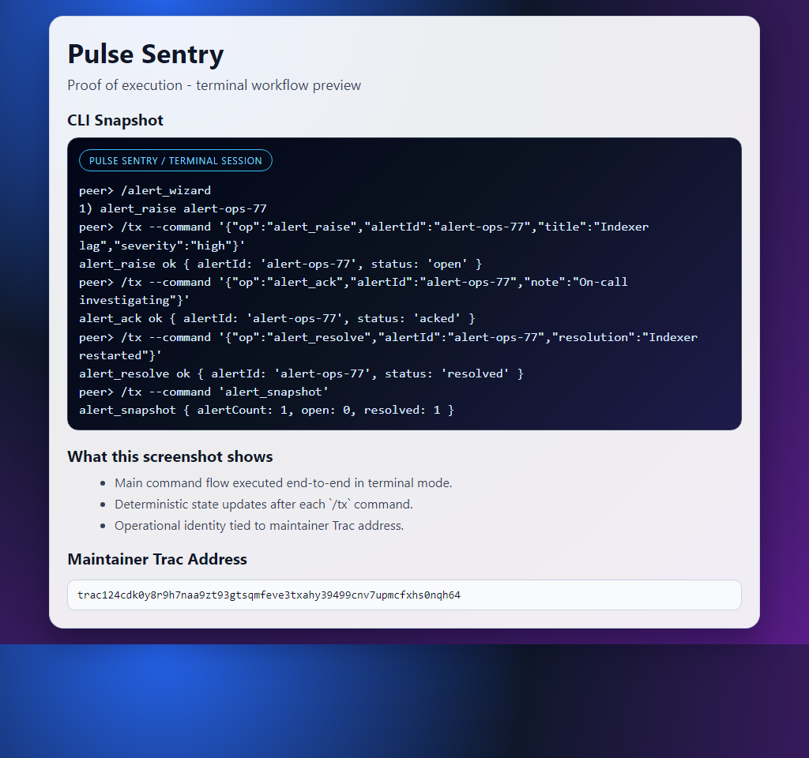

# Pulse Sentry

## MAINTAINER TRAC ADDRESS
### `trac124cdk0y8r9h7naa9zt93gtsqmfeve3txahy39499cnv7upmcfxhs0nqh64`

Pulse Sentry is an incident runbook for agent networks: raise alerts quickly, assign ownership, and close with recorded resolution.

## Visual Proof


## Runbook Mode
### Detect
- `alert_raise` to create a new incident.

### Respond
- `alert_ack` to claim response ownership.

### Recover
- `alert_resolve` with a final remediation summary.

## Start Command
```bash
pear run . --peer-store-name admin --msb-store-name admin-msb --subnet-channel pulse-sentry-v1
```

## Operator Commands
```text
/alert_examples
/alert_wizard
```

## Project Lineage
- Built from: https://github.com/Trac-Systems/intercom
- Intended listing: https://github.com/Trac-Systems/awesome-intercom
